# p7_web-service-exposant-une-API

# Installation

1. Télécharger le projet de Github
2. Lancer composer install
3. Connecter la bdd dans le fichier .env
4. Jouer php bin/console d:f:l pour lancer les fixtures et remplir la base de donnée.
5. Jouer symfony serve -d pour initialiser le serveur.
6. Jouer php bin/console cache:clear pour vider le cacher.
7. Aller sur l'url de ton serveur /api/doc pour visualiser Nelmio et voir la doc de l'api.

# Documentation de Nelmio

## Se connecter

1. Aller sur l'url de ton serveur /api/doc

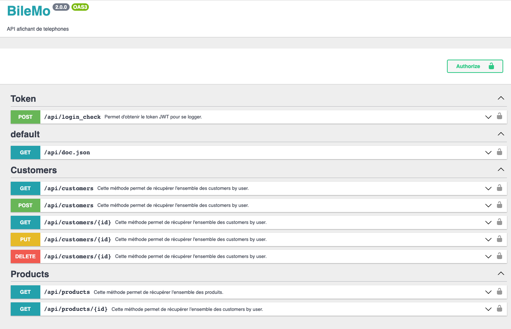

2. Sur Token on va demander le token JWT de user test en clicant sur Try it out puis execute.

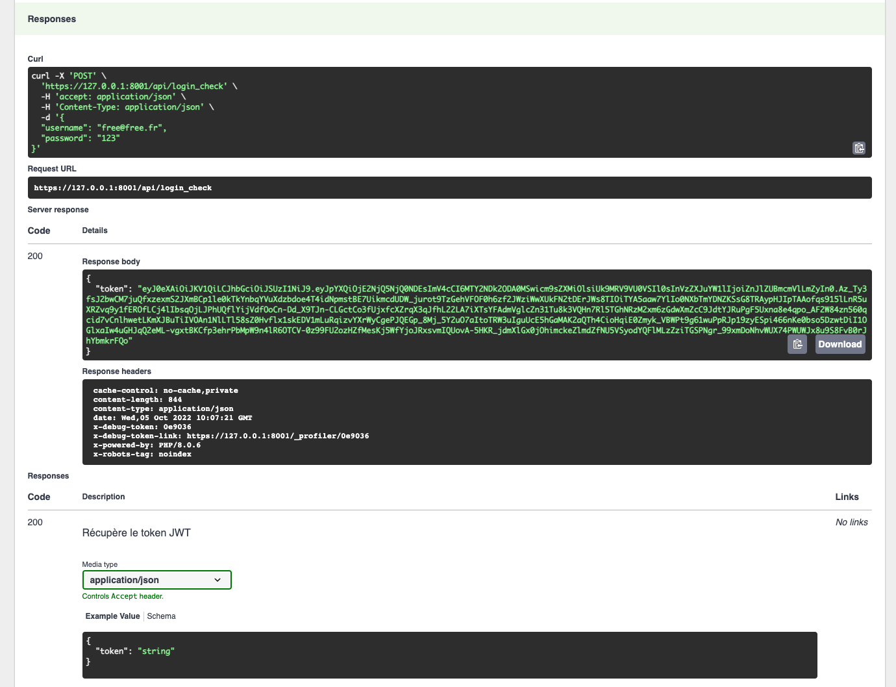

Ici on recupere le token que on dois copié pour s'authentifier.

3. On clic sur le button Authorize sur la partie superior droite puis on ajoute
    - bearer (votre token)
    - on clic sur Authorize puis on ferme la modal
   

   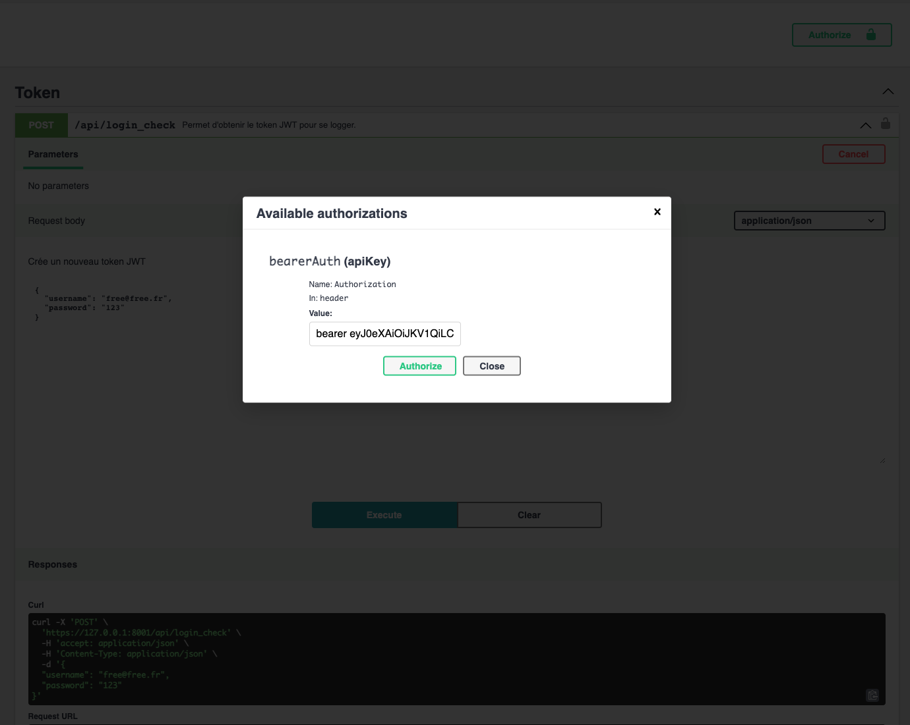
   
 
## Customers

1. Voir tout les customers qui partien a l'utilisateur de test.
    - Dans la section customers clic sur GET /api/customers
    - Clic sur Try it out puis ajouter sur page 1, la limite par default est 3
    - Puis execute
   
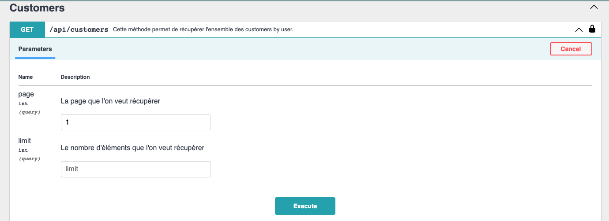

   - Une fois execute il afiche les customers qui partiens a l'utilisateur avec les url autodecubrable selon Richardson.

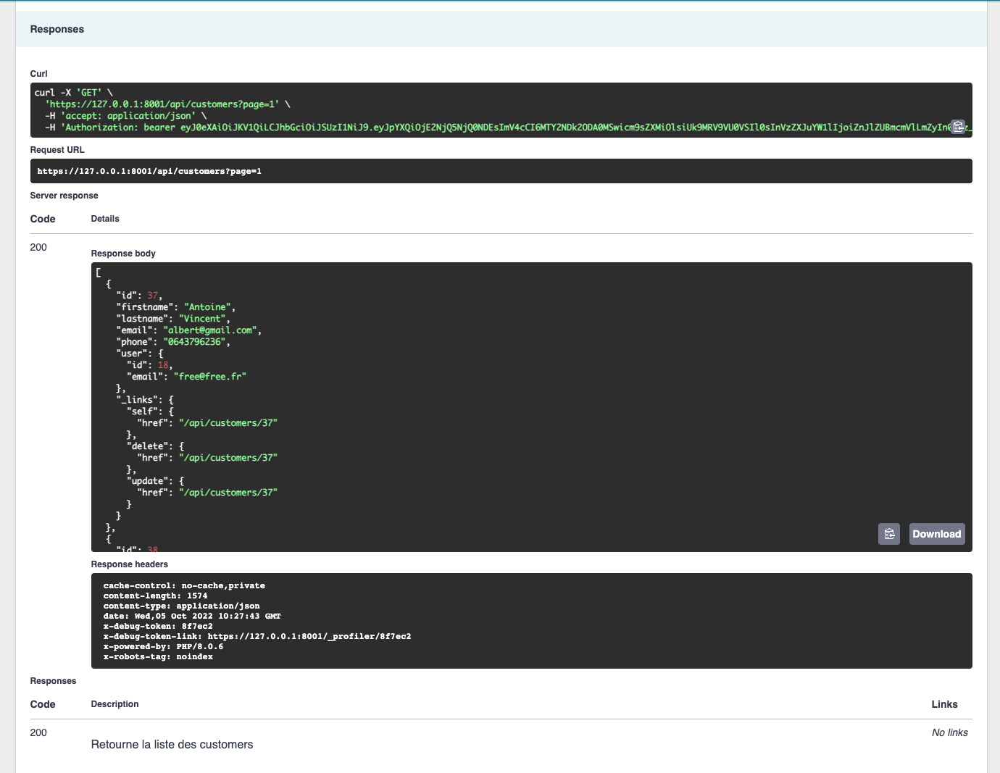

2. Afficher un customer selon son id.

- On clic sur GET /api/customers/{id}
- Button Try it out puis on renseigne l'id que l'on veut voir, important si le customer nous partiens pas on ne pourrait pas le voir

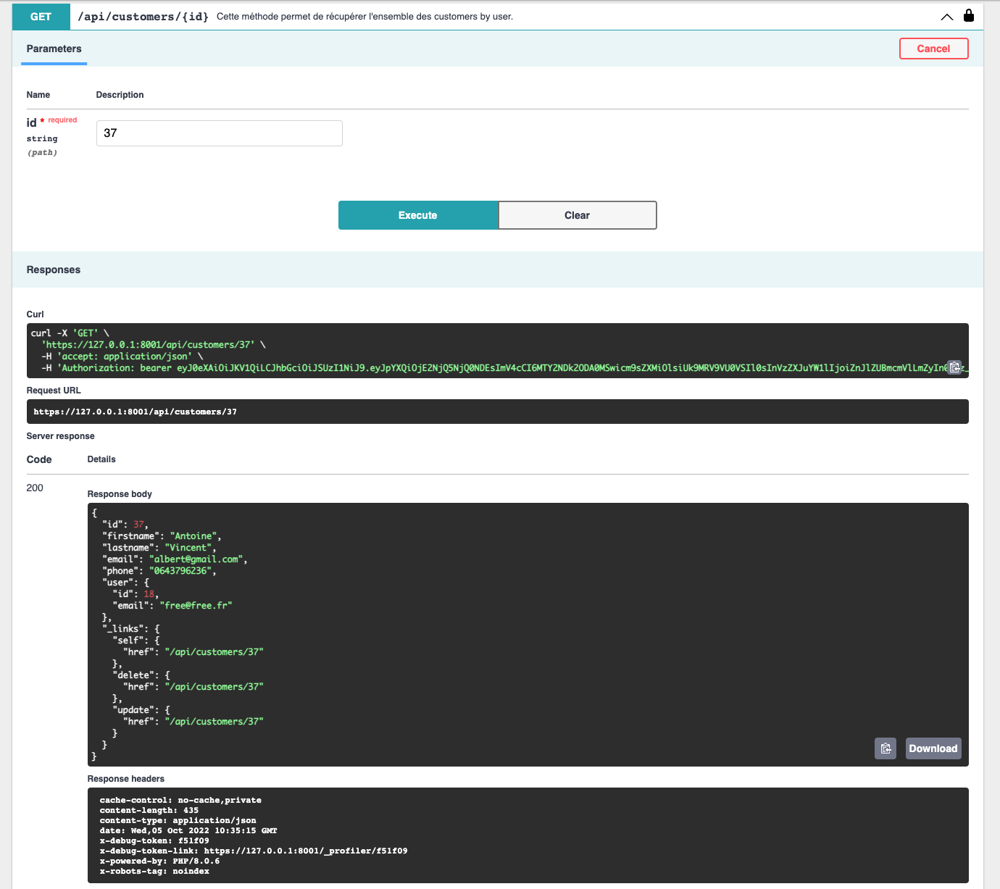

3. Ajouter un customer.
- On clic sur POST /api/customers
- On clic sur Try it out puis on remplace le text string par les information que l'on veut renseigner.
- On execute

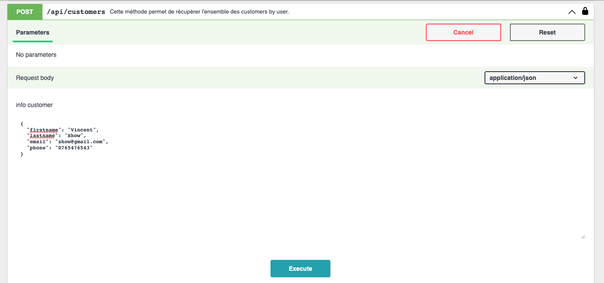

- On obtien une reponse avec les informations de nouveau customer tel que id, prenom, nom, mail, telephone, l'user qui partien et les url de modification et supresion auto decubrable selon Richardson.

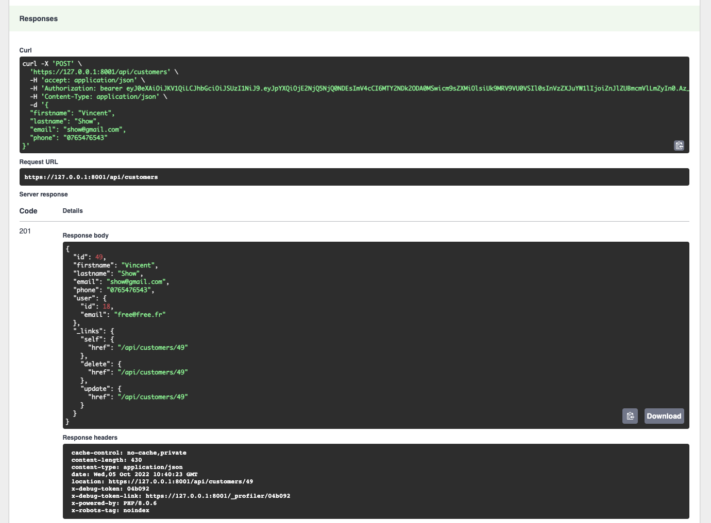

4. Modifier un customer
- On clic sur PUT /api/customers/{id}
- On clic sur Try it out puis on renseigne l'id de customer que on veut modifier et que nous partien.
- sur info customer on change le text string pour la nouvelle information puis on execute.

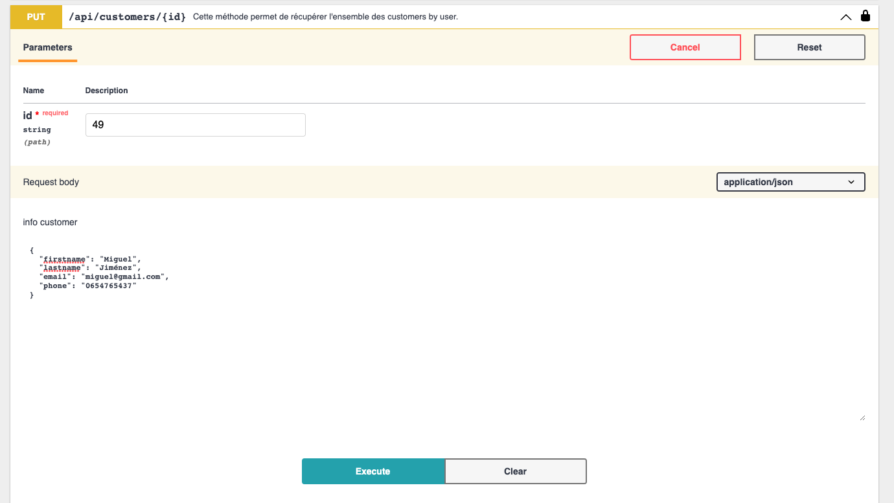

- une fois envoie on obtient une reponse 

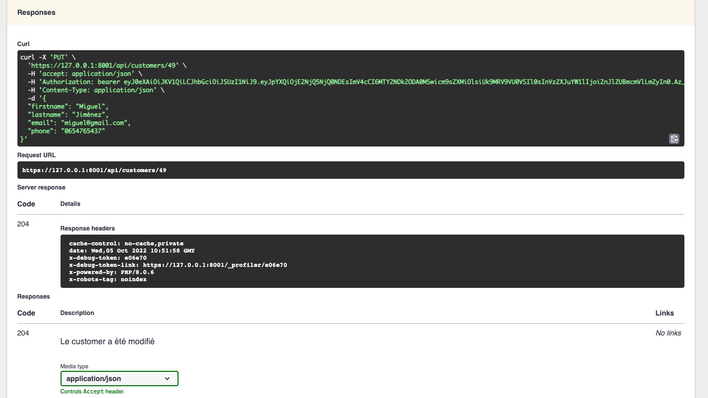

5. Suprimer un customer
- On clic sur DELETE /api/customers/{id}
- On clic sur Try it out puis on renseigne l'id de customer a suprimer il faut que nous partines.
- On execute

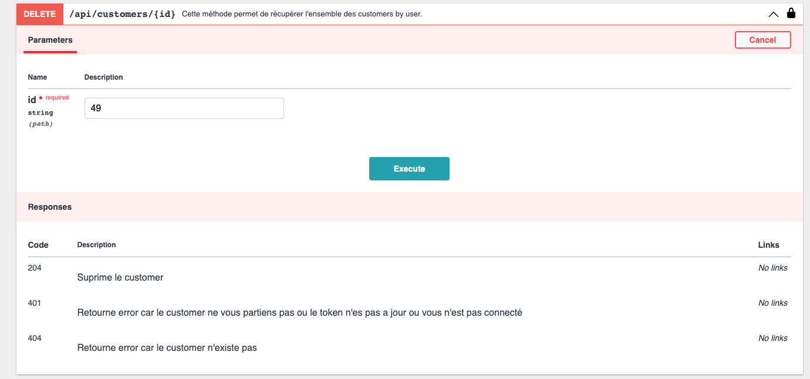

-on obtien une reponse

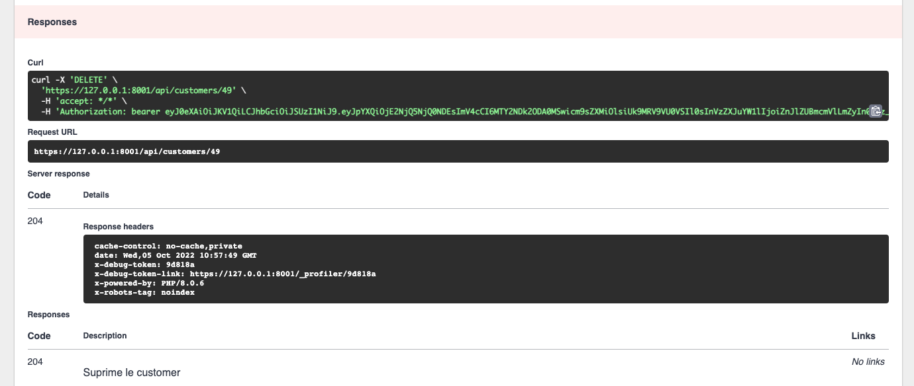

# Products

1. Recuperer tous les produits
- Aller sur GET /api/products
- On clic sur Try it out puis sur page on renseigne la premiere.
- On execute

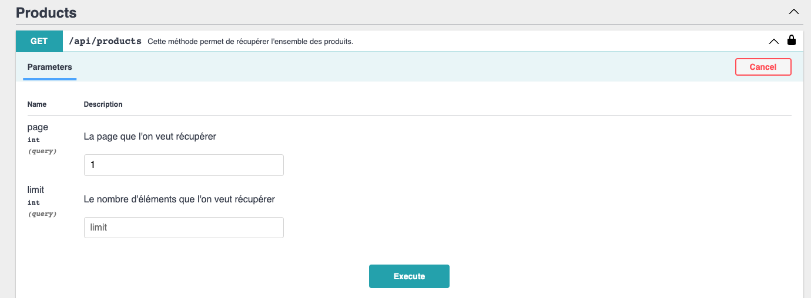

-On obtient une reponse avec les trois premieres produits

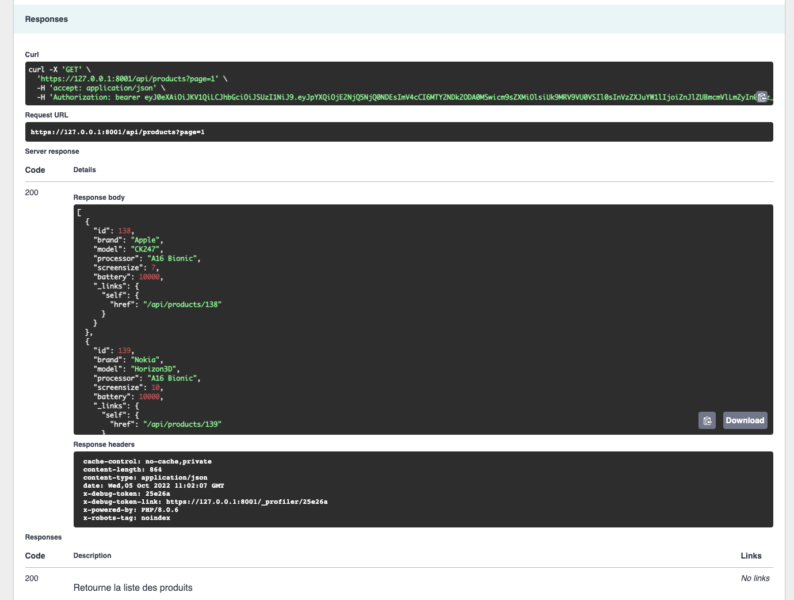

2. Recuperer l'information d'un produit selon id
- Aller sur GET /api/products/{id}
- On clic sur Try it out puis on renseigne l'id de produit.
- On execute

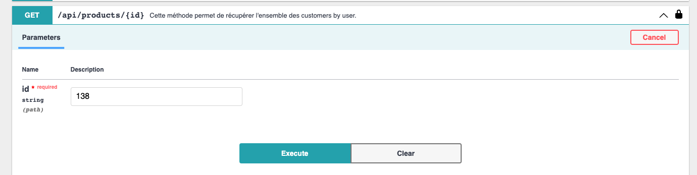

- On obtient une reponse avec les informations de produit.

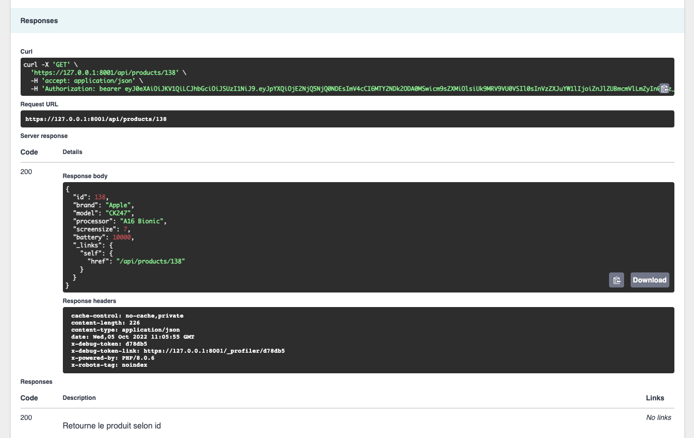

# Code de reponses

Vous trouvez dans chaque requete une explication de reponses posibles avec une explication.
- exemple

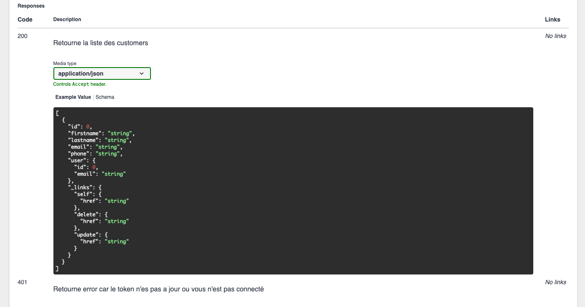